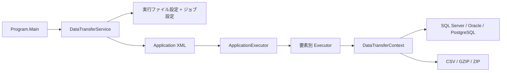

# DTFX アーキテクチャ

## 概要

DTFX は .NET Framework 4.6.2 上で動作する Windows 向けコンソール ETL エンジンです。XML の `<Application>` 直下にある要素を上から順に解釈し、各要素に対応する Executor が処理を実行します。

## ソリューション構成

| プロジェクト | 役割 | 出力 |
|---|---|---|
| `IF.Batch.Common` | ログ、CSV、構成、ファイル操作、サービスインターフェース | DLL |
| `IF.Batch.DTFX` | XML 解析、ジョブ実行、データベースとファイルの連携 | EXE |
| `DTFX.SmokeTests` | コアロジック、XSD、サンプルの整合性検証 | EXE |

`IF.Batch.DTFX` は `IF.Batch.Common` をプロジェクト参照し、テストプロジェクトは両方を参照します。

### ビルド構成のマッピング

`IF.Batch.DTFX` は `Any CPU` と `x86` の両方を持ちます。一方、マネージドコードだけで構成される `IF.Batch.Common` は、ソリューションが `x86` の場合も `Any CPU` へマッピングされます。Debug / Release の両方で `Build.0` が設定されているため、ソリューションビルドから Common が除外されることはありません。対応表とコマンド例は [`common-library.md`](common-library.md#ビルド構成) を参照してください。

## 実行フロー

1. `Program` が `-appid` と `-appdirectory` を解析します。
2. 実行ファイルの `app.config`、任意の `{appid}.config`、コマンドライン引数を AppSettings にマージします。
3. `DataTransferService` が `{appid}.xml` を読み込み、共通設定を `DataTransferContext` に反映します。
4. `ApplicationExecutor` が `<Application>` の子要素を上から順に処理します。
5. 要素名に対応する Executor が SQL、ファイル、または制御フローの処理を実行します。
6. 最終結果がエラーなら未確定トランザクションをロールバックし、成功または警告ならコミットします。

設定のマージ規則は [`configuration.md`](configuration.md) を参照してください。

## Element と Executor

`Elements/` のクラスは XML 属性を保持するデータモデル、`Executors/` のクラスは実行ロジックです。`ApplicationExecutor` は生成処理を `IExecutorFactory` に委譲し、標準実装の `ExecutorFactory` が要素名と Executor の登録を一元管理します。`If` と `ForEach` の子要素にも同じファクトリが引き継がれるため、ネストした処理を含めて生成方法を差し替えられます。

サポートする処理は次のとおりです。

- SQL Server: Select、SelectScalar、Insert、Update、Delete、Bulk Insert
- Oracle: Select、SelectScalar、Insert、Update、Delete、Bulk Insert
- PostgreSQL: Select、SelectScalar、Insert、Update、Delete、Bulk Insert
- LocalDB: Select、SelectScalar、Insert、Update、Delete
- 制御フロー: If、ForEach、AppExit
- ファイル・その他: LoadCSV、ExecuteCommand、TraceLog、ZipArchive、AddFile

要素名と属性の詳細は [`xml-elements.md`](xml-elements.md) を参照してください。複数の処理結果は `Error > Warning > Success` の優先順位で統合されます。

`DataTransferService` は既定コンストラクタで標準構成を組み立てます。また、`IDataTransferContextFactory` と `IExecutorFactory` を受け取るコンストラクタを公開しており、テストや将来の DI コンテナから実行時依存関係を渡せます。

## 共有コンテキストとトランザクション

`DataTransferContext` は、1 回のジョブ実行中に次の状態を共有します。

- データベース接続とトランザクション
- `${variable}` で参照する共有変数
- 入力、出力、バックアップ、エラーの各ディレクトリ
- CSV のエンコーディング、区切り文字、ヘッダー、読み書き件数の制限
- SQL Server の `tempdb` を使う LocalDB 一時テーブル

データベース接続は必要になった時点で作成され、失敗時は最大 3 回、2 秒間隔で試行します。通常のデータソースでは接続時にトランザクションも開始します。`ForEach` は `transaction`、`transactionOnError`、`stopOnError` 属性でループ後のトランザクション制御を変更できます。

## XML スキーマ

`DTFX/XMLSchema/Application.xsd` が、サポートする要素と属性を定義します。現在のランタイムは XML の読み込みと `<Application>` ルートの確認のみを行い、実行時に XSD 検証を強制しません。代わりに、スモークテストと CI が XSD 自体のコンパイルと同梱サンプルのスキーマ整合性を検証します。

この分離は既存ジョブとの互換性を維持しながら、新しいサンプルに誤りが入ることを防ぐためのものです。将来ランタイム検証を導入する場合は、既存ジョブ向けの互換性オプションを用意する必要があります。

## 依存関係とプラットフォーム

- 対象フレームワーク: .NET Framework 4.6.2
- SQL Server: `System.Data.SqlClient`
- Oracle: `Oracle.ManagedDataAccess` 19.31.0
- PostgreSQL: `Npgsql` 4.1.14
- 条件式: JexlNet 2.9.3
- ZIP: DotNetZip 1.16.0
- ファイルログ: Serilog 2.12.0 / Serilog.Sinks.File 5.0.0
- パッケージ管理: `packages.config`

古いランタイムとデータプロバイダーは、既存環境との互換性を保つための基準です。メジャーバージョンを更新する場合は、実データベースを使った統合テストを伴う独立した変更として扱ってください。

## セキュリティ境界

ジョブ XML は、データベース上の SQL と Windows コマンドを実行できるため、コードに相当する入力です。信頼できない利用者が XML、ジョブ固有の config、共有変数を変更できないように運用してください。実際の接続文字列や認証情報はリポジトリへコミットしないでください。
