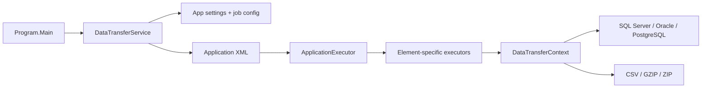

# DTFX 아키텍처

## 개요

DTFX는 .NET Framework 4.6.2 기반의 Windows 콘솔 ETL 엔진입니다. XML의 `<Application>` 자식 요소를 위에서 아래로 해석하며, 각 요소와 대응하는 Executor가 실제 작업을 수행합니다.

## 솔루션 구성

| 프로젝트 | 역할 | 출력 |
|---|---|---|
| `IF.Batch.Common` | 로깅, CSV, 설정, 파일 및 서비스 인터페이스 | DLL |
| `IF.Batch.DTFX` | XML 파싱, 작업 실행, DB 및 파일 연계 | EXE |
| `DTFX.SmokeTests` | 핵심 로직과 XSD/예제 정합성 검사 | EXE |

`IF.Batch.DTFX`는 `IF.Batch.Common`만 프로젝트 참조합니다. 테스트 프로젝트는 두 프로젝트를 참조합니다.

## 실행 흐름

1. `Program`이 `-appid`와 `-appdirectory`를 읽습니다.
2. 기본 `app.config`, 선택적 `{appid}.config`, 명령행 인수를 AppSettings에 병합합니다.
3. `DataTransferService`가 `{appid}.xml`을 읽고 공용 설정을 `DataTransferContext`에 구성합니다.
4. `ApplicationExecutor`가 `<Application>`의 자식 요소를 순서대로 순회합니다.
5. 요소 이름에 해당하는 Executor가 SQL, 파일 또는 제어 흐름 작업을 실행합니다.
6. 최종 결과가 오류면 트랜잭션을 Rollback하고, 성공 또는 경고면 Commit합니다.

## Element와 Executor

`Elements/`의 클래스는 XML 속성을 담는 데이터 모델이고, `Executors/`의 클래스는 실행 로직입니다. `ApplicationExecutor.CreateExecutor`가 요소 이름을 Executor로 매핑합니다.

지원 범주는 다음과 같습니다.

- SQL Server: Select, SelectScalar, Insert, Update, Delete, Bulk Insert
- Oracle: Select, SelectScalar, Insert, Update, Delete, Bulk Insert
- PostgreSQL: Select, SelectScalar, Insert, Update, Delete, Bulk Insert
- LocalDB: Select, SelectScalar, Insert, Update, Delete
- 제어 흐름: If, ForEach, AppExit
- 파일·기타: LoadCSV, ExecuteCommand, TraceLog, ZipArchive, AddFile

결과 코드는 `Error > Warning > Success` 우선순위로 병합합니다.

## 공유 컨텍스트와 트랜잭션

`DataTransferContext`는 다음 상태를 한 작업 실행 동안 공유합니다.

- DB 연결과 트랜잭션
- `${variable}`로 참조하는 공유 변수
- 입력·출력·백업·오류 디렉터리
- CSV 인코딩, 구분자, 헤더, 읽기/쓰기 제한
- LocalDB 임시 테이블

DB 연결은 최대 3회, 2초 간격으로 시도합니다. `ForEach`는 요소의 `transaction`, `transactionOnError`, `stopOnError` 속성으로 반복 단위 트랜잭션을 제어할 수 있습니다.

## XML 스키마

`DTFX/XMLSchema/Application.xsd`가 지원 요소와 속성을 정의합니다. 현재 런타임은 XML 로드와 `<Application>` 루트 확인을 수행하고 XSD를 강제하지 않습니다. 대신 스모크 테스트와 CI가 XSD 자체의 컴파일 및 제공 예제의 스키마 정합성을 검사합니다.

이 구분은 이전 작업 정의와의 호환성을 유지하면서 새 예제가 잘못 추가되는 것을 막기 위한 것입니다. 향후 런타임 강제 검증을 도입한다면 호환성 옵션으로 제공하는 것이 안전합니다.

## 의존성과 플랫폼

- 대상 프레임워크: .NET Framework 4.6.2
- SQL Server: `System.Data.SqlClient`
- Oracle: `Oracle.ManagedDataAccess` 19.18
- PostgreSQL: `Npgsql` 4.1.12
- ZIP: DotNetZip 1.15.0
- 패키지 관리: `packages.config`

오래된 런타임과 데이터 공급자는 호환성 기준선입니다. 새 메이저 버전으로 이동할 때는 실제 DB 통합 테스트와 함께 별도 변경으로 진행해야 합니다.

## 보안 경계

작업 XML은 데이터베이스 SQL과 Windows 명령을 실행할 수 있는 코드에 준하는 입력입니다. 신뢰하지 않는 사용자가 XML, 작업별 config 또는 공유 변수를 수정할 수 없도록 운영해야 합니다. 연결 문자열과 실제 자격 증명은 저장소에 커밋하지 않습니다.
